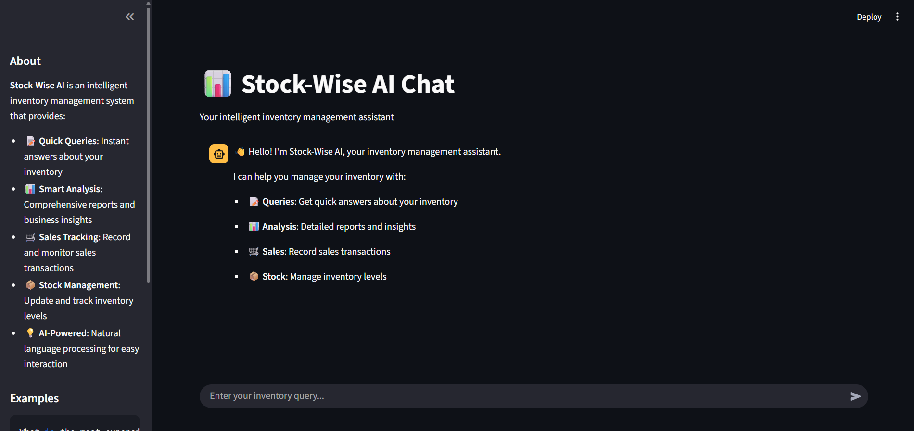
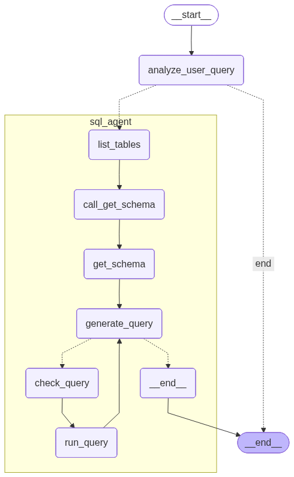

# Stock-Wise AI



An intelligent inventory management assistant powered by AI that helps you manage your inventory with natural language queries.


## Workflow



## Features

- **Smart Queries**: Get instant answers about your inventory using natural language
- **Analysis & Insights**: Generate comprehensive business reports and trend analysis
- **Sales Tracking**: Record and monitor sales transactions effortlessly  
- **Stock Management**: Update and track inventory levels with ease
- **AI-Powered**: Natural language processing for intuitive interactions

## Quick Start

### Prerequisites

- Python 3.8+
- SQLite database
- OpenAI API key or compatible LLM endpoint

### Installation

1. **Clone the repository**
   ```bash
   git clone <repository-url>
   cd stock-wise-ai
   ```

2. **Install dependencies**
   ```bash
   pip install -r requirements.txt
   # or using uv
   uv sync
   ```

3. **Set up environment variables**
   ```bash
   # Required: API key for your chosen provider
   export GOOGLE_API_KEY="your-google-api-key-here"        # For Google AI
   # or
   export OPENAI_API_KEY="your-openai-api-key-here"        # For OpenAI
   
   # Optional: LLM Provider (defaults to google_genai)
   export LLM_PROVIDER="google_genai"    # or "openai", "anthropic", etc.
   
   # Optional: Model configuration (defaults to gemini-2.5-flash)
   export LLM_MODEL="gemini-2.5-flash"
   # Other options: "gemini-1.5-pro", "gpt-4", "gpt-3.5-turbo", "claude-3-sonnet"
   
   # Optional: Temperature for LLM responses (0.0 to 1.0, default: 0.1)
   export LLM_TEMPERATURE="0.1"
   
   # Optional: Currency display (defaults to naira)
   export CURRENCY_TYPE="naira"          # or "dollar", "pound"
   ```

4. **Initialize the database**
   ```bash
   python -c "import sqlite3; sqlite3.connect('inventory.db').close()"
   ```

### Running the Application

#### Streamlit Web Interface
```bash
streamlit run streamlit_app.py
```
Open your browser to `http://localhost:8501`

#### Command Line Interface
```bash
python main.py
```

## Usage Examples

### Inventory Queries
- "What items do we have in stock?"
- "What is the most expensive item?"
- "How many digestive biscuits do we have?"

### Sales Recording
- "Sold 5 digestive biscuits today"
- "Record sale of 10 tea bags on September 1st"

### Stock Management
- "Add 20 coca cola bottles to inventory"
- "Stock 15 peak milk sachets"

### Analysis & Reporting
- "Analyze sales trends this month"
- "Provide a detailed analysis on the best product to sell in the future"
- "Generate a comprehensive inventory report"

## Project Structure

```
stock-wise-ai/
├── streamlit_app.py          # Web interface
├── main.py                   # CLI interface  
├── models.py                 # Data models and state management
├── inventory_agent_query.py  # Query analysis agent
├── inventory_agent_sql.py    # SQL execution agent
├── prompts.py               # LLM prompts and instructions
├── utils.py                 # Utility functions
├── inventory.db             # SQLite database
└── README.md               # This file
```

## Core Components

### 1. Query Analysis Agent (`inventory_agent_query.py`)
- Analyzes user queries to determine intent
- Classifies operations: QUERY, ANALYSIS, SALE, STOCK
- Handles clarification and validation

### 2. SQL Agent (`inventory_agent_sql.py`)
- Executes database queries securely
- Generates natural language responses
- Handles complex analysis operations

### 3. Streamlit Interface (`streamlit_app.py`)
- Modern web-based chat interface
- Real-time query processing
- Message history management

### 4. Models (`models.py`)
- Pydantic models for type safety
- LangGraph state management
- Query analysis structures

## Database Schema

The system uses a SQLite database with tables for:
- **Products**: Item information, prices, quantities
- **Sales**: Transaction records
- **Inventory**: Stock levels and movements

## Configuration

### Currency Settings
Update currency configuration in `utils.py`:
```python
def get_currency_config():
    return {
        "name": "Nigerian Naira",
        "symbol": "₦",
        "example": "₦250"
    }
```

### LLM Configuration

#### Environment Variables
The application uses LangChain's universal model interface with these variables:

- **`LLM_PROVIDER`** (Optional): Provider name (default: `google_genai`)
  - Options: `google_genai`, `openai`, `anthropic`, `cohere`, etc.
- **`LLM_MODEL`** (Optional): Model name (default: `gemini-2.5-flash`)
  - Google: `gemini-1.5-pro`, `gemini-2.5-flash`, etc.
  - OpenAI: `gpt-4`, `gpt-3.5-turbo`, etc.
  - Anthropic: `claude-3-sonnet`, `claude-3-haiku`, etc.
- **`LLM_TEMPERATURE`** (Optional): Response creativity (default: `0.1`)
- **Provider API Keys** (Required): Set the appropriate key for your provider
  - Google AI: `GOOGLE_API_KEY`
  - OpenAI: `OPENAI_API_KEY`  
  - Anthropic: `ANTHROPIC_API_KEY`

#### Current Implementation
The system uses LangChain's `init_chat_model` function in `utils.py`:
```python
def create_llm():
    provider = os.getenv("LLM_PROVIDER", "google_genai")
    model = os.getenv("LLM_MODEL", "gemini-2.5-flash")
    temperature = float(os.getenv("LLM_TEMPERATURE", "0.1"))

    return init_chat_model(
        model=model,
        model_provider=provider,
        temperature=temperature
    )
```

#### Additional Configuration
- **Currency Display**: Set `CURRENCY_TYPE` to `naira`, `dollar`, or `pound`
- **Environment File**: The app loads from `.env` file automatically

## Security Features

- **SQL Injection Protection**: Uses parameterized queries
- **Authentication Required**: Updates require password verification
- **Read-only Operations**: Safe query execution by default

## Development

### Adding New Features

1. **New Query Types**: Update `inventory_agent_query.py`
2. **Database Operations**: Modify `inventory_agent_sql.py`  
3. **UI Components**: Extend `streamlit_app.py`

### Testing
```bash
python -m pytest tests/
```

### Code Quality
```bash
# Format code
black .

# Type checking
mypy .

# Linting
flake8 .
```

## Deployment

### Local Development
```bash
streamlit run streamlit_app.py
```

### Production Deployment
1. Set up environment variables
2. Configure database connection
3. Deploy using your preferred platform (Streamlit Cloud, Heroku, etc.)

## Troubleshooting

### Common Issues

**Slow Analysis Queries**
- Analysis operations may take time for complex reports
- Consider simplifying queries or adding timeouts

**Database Connection Errors**
- Ensure `inventory.db` exists and has proper permissions
- Check database schema is properly initialized

**LLM API Errors**
- Verify API keys and configuration:
  ```bash
  echo $GOOGLE_API_KEY     # For Google AI
  echo $OPENAI_API_KEY     # For OpenAI
  echo $LLM_PROVIDER       # Current provider
  echo $LLM_MODEL          # Current model
  ```
- Check rate limits and quotas for your provider
- Ensure API key has sufficient credits/quota
- Try with different models:
  ```bash
  export LLM_MODEL="gemini-1.5-pro"        # For Google
  export LLM_MODEL="gpt-3.5-turbo"         # For OpenAI
  export LLM_MODEL="claude-3-haiku"        # For Anthropic
  ```

**Environment Variable Issues**
- Check current configuration: 
  ```bash
  env | grep LLM        # LLM configuration
  env | grep GOOGLE     # Google AI key
  env | grep OPENAI     # OpenAI key
  ```
- Create a `.env` file in the project root:
  ```bash
  GOOGLE_API_KEY=your-google-key-here
  LLM_PROVIDER=google_genai
  LLM_MODEL=gemini-2.5-flash
  LLM_TEMPERATURE=0.1
  CURRENCY_TYPE=naira
  ```
- Or export directly (temporary):
  ```bash
  export GOOGLE_API_KEY="your-google-key-here"
  export LLM_PROVIDER="google_genai"
  ```

### Performance Tips

- Use specific queries instead of broad analysis requests
- Batch multiple operations when possible
- Monitor database size and optimize as needed

## Contributing

1. Fork the repository
2. Create a feature branch
3. Make your changes
4. Add tests if applicable
5. Submit a pull request

## License

This project is licensed under the MIT License - see the LICENSE file for details.

## Support

For questions, issues, or feature requests:
- Open an issue on GitHub
- Check the troubleshooting section above
- Review the code documentation

---

**Stock-Wise AI** - Making inventory management intelligent and intuitive!